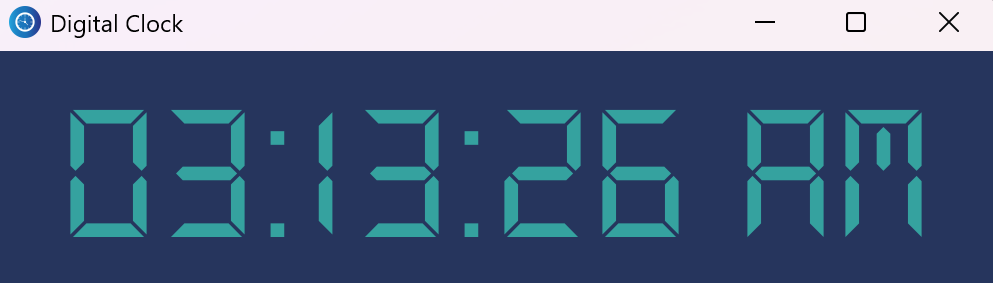

# Digital Clock App

This is a simple Digital Clock application built with Python.

## Preview



## How to Run the Program

1. **Pull the Repository**

```bash
   git clone <https://github.com/yuutoa/digital-clock.git>
```

2. **Create a Virtual Environment**

```bash
   python -m venv venv
```

3. **Activate the Virtual Environment**

   - On Windows:
     ```bash
     .\venv\Scripts\activate
     ```
   - On MacOS/Linux:
     ```bash
     source venv/bin/activate
     ```

4. **Install Requirements**

```bash
   pip install -r requirements.txt
```

5. **Run the Application**

```bash
   python digital_clock.py
```

___

[Yuuto Akihiro](https://github.com/yuutoa)

